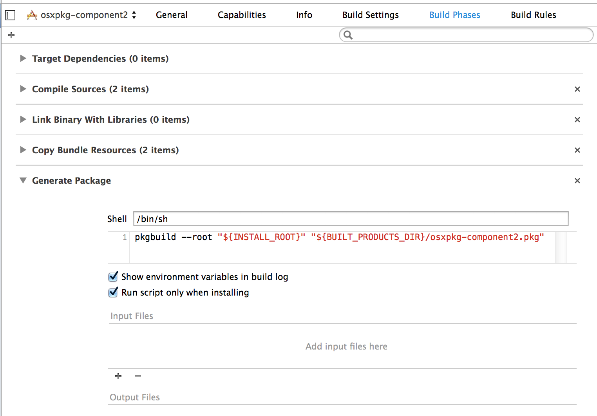

# 制作 Mac OS X 驱动安装包

本文描述了如何使用 [productbuild](https://developer.apple.com/library/mac/documentation/Darwin/Reference/ManPages/man1/productbuild.1.html) 命令行生成 Mac OS X 安装包。

由于 PackageMaker 的各种坑，而且命令行也不好用，参考了
[Making OS X Installer Packages like a Pro ](http://stackoverflow.com/questions/11487596/making-os-x-installer-packages-like-a-pro-xcode4-developer-id-mountain-lion-re/11487658#11487658) 后，
决定把生成安装包的方式换成 [pkgbuild](http://developer.apple.com/library/mac/documentation/Darwin/Reference/Manpages/man1/pkgbuild.1.html) 和 
[productbuild](https://developer.apple.com/library/mac/documentation/Darwin/Reference/ManPages/man1/productbuild.1.html)。

## 组件

### 新建组件
新建两个测试工程，[osxpkg-component1](http://git.pantum.com/hdc/osxpkg-component1)，[osxpkg-component2](http://git.pantum.com/hdc/osxpkg-component2)，作为installer的组件。

### 降级安装

以 component2 为例子，生成组件 plist 文件：

```pkgbuild --analyze --root /tmp/osxpkg-component2.dst components.plist```

生成的 components.plist 内容如下：

```
<?xml version="1.0" encoding="UTF-8"?>
<!DOCTYPE plist PUBLIC "-//Apple//DTD PLIST 1.0//EN" "http://www.apple.com/DTDs/PropertyList-1.0.dtd">
<plist version="1.0">
<array>
	<dict>
		<key>BundleHasStrictIdentifier</key>
		<true/>
		<key>BundleIsRelocatable</key>
		<true/>
		<key>BundleIsVersionChecked</key>
		<true/>
		<key>BundleOverwriteAction</key>
		<string>upgrade</string>
		<key>RootRelativeBundlePath</key>
		<string>Applications/osxpkg-component2.app</string>
	</dict>
</array>
</plist>
```

要降级安装，需要修改 ```BundleIsVersionChecked``` 为 ```false```，由于 shell 脚本操作 plist 文件不方便，
我写了一个 ruby 脚本，需要安装 [plist](http://plist.rubyforge.org) 库，内容如下：

```
require 'Plist'

result = Plist::parse_xml(ARGV[0])
if result
  result[0]['BundleIsRelocatable'] = false
  result[0]['BundleIsVersionChecked'] = false
  result.save_plist(ARGV[0])
end
```


### 修改配置
增加一个`Run Script Build Phase`，命名为 `Generate Package`，勾选 `Run script only when installing`:

```
pkgbuild --analyze --root "${INSTALL_ROOT}" "${BUILT_PRODUCTS_DIR}/${PROJECT_NAME}.plist"
ruby ./dont_version_checked.rb "${BUILT_PRODUCTS_DIR}/${PROJECT_NAME}.plist"
pkgbuild --root "${INSTALL_ROOT}" \
	--component-plist "${BUILT_PRODUCTS_DIR}/${PROJECT_NAME}.plist" \
	"${BUILT_PRODUCTS_DIR}/${PROJECT_NAME}.pkg"
```




### 构建组件安装包
打开终端，分别进入两个工程根目录，输入下面命令，将会在 `build/Release/` 生成 `osxpkg-component1.pkg` 和 `osxpkg-component2.pkg`:
```
$ xcode-build install
```

如果`xcode-build`失败，可能是因为没有设置好 `Xcode`：
```
$ xcode-select -s /Applications/Xcode.app
```

## 分发安装包

我们约定分发安装包( Distribution )工程有 `Packages` 和 `Resources` 目录。
* `Packages` 包含各模块的`osxpkg`安装包，
包含我们上一节生成的两个组件，`osxpkg-component1.pkg` 和 `osxpkg-component2.pkg`。
* `Resources` 包含license文件。

### 生成 Distribution Definition

开始的时候，需要创建一个[Distribution Definition](https://developer.apple.com/library/mac/documentation/DeveloperTools/Reference/DistributionDefinitionRef/Chapters/Introduction.html#//apple_ref/doc/uid/TP40005370-CH1-DontLinkElementID_16)文件。

```shell
$ productbuild --synthesize \
    --package Packages/test1-1.0.pkg \
    --package Packages/test2-1.0.pkg \
    distribution.dist
```

distribution.dist的内容如下：

```xml
<?xml version="1.0" encoding="utf-8" standalone="no"?>
<installer-gui-script minSpecVersion="2">
    <pkg-ref id="test1"/>
    <pkg-ref id="test2"/>
    <options customize="never" require-scripts="false"/>
    <license file="License"/>
    <volume-check>
        <allowed-os-versions>
            <os-version min="10.6.8"/>
        </allowed-os-versions>
    </volume-check>
    <choices-outline>
        <line choice="default">
            <line choice="test1"/>
            <line choice="test2"/>
        </line>
    </choices-outline>
    <choice id="default"/>
    <choice id="test1" visible="false">
        <pkg-ref id="test1"/>
    </choice>
    <pkg-ref id="test1" version="1.0" onConclusion="none">test1-1.0.pkg</pkg-ref>
    <choice id="test2" visible="false">
        <pkg-ref id="test2"/>
    </choice>
    <pkg-ref id="test2" version="1.0" onConclusion="none">test2-1.0.pkg</pkg-ref>
</installer-gui-script>
```

### 限制只能安装到系统盘

编辑 distribution.dist, 修改```options```增加```rootVolumeOnly="true"```属性。

### 增加license

编辑 distribution.dist, 增加```<license file="License"/>```

### 安装后重启系统

编辑 distribution.dist，修改 ```pkg-ref``` 的属性 ```onConclusion="RequireRestart"```

### 增加javascript脚本
可以在distribution.dist增加javascript脚本，下面定义了两个函数判断操作系统的版本。

```javascript
  <script>
  <![CDATA[
    function lt_109() {
      return system.compareVersions(system.version.ProductVersion, '10.9.0') < 0;
    }
    function ge_109() {
      return system.compareVersions(system.version.ProductVersion, '10.9.0') >= 0;
    }
  ]]>
  </script>
```

choice可以引用```lt_109```和```ge_109```，在10.9以下的系统安装```test1```，10.9以上的系统安装```test2```：

```javascript
	<choice id="test1" visible="false"  selected="lt_109()" enabled="lt_109()">
	    <pkg-ref id="test1"/>
	</choice>
	<choice id="test2" visible="false" selected="ge_109()" enabled="ge_109()">
	    <pkg-ref id="test2"/>
	</choice>
```

### 构建分发安装包

运行 [build.sh](build.sh) 脚本，或者终端输入下面命令：
```
$ mkdir -p ./dist
$ productbuild --distribution ./distribution.dist \
    --package-path ./Packages \
		--resources ./Resources \
    ./dist/Installer.pkg
```


